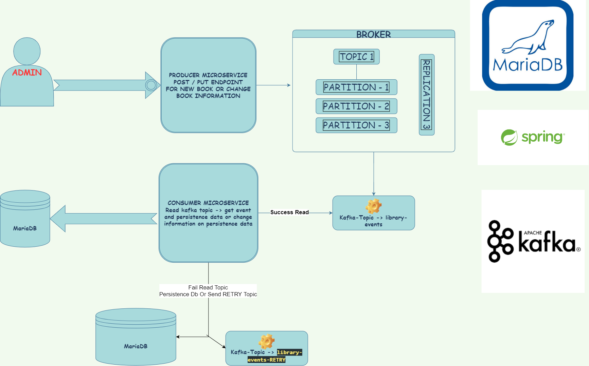

# Library event project with apache kafka -> event driven with microservices architecture

# Diagram

# Technology Stack :

 > Spring Boot

 > Apache Kafka

 > H2 DB

 > Integration And Unit Testing

 > Spring Data
 
 > Kafka security with SSL security. Add and finished project..
 
